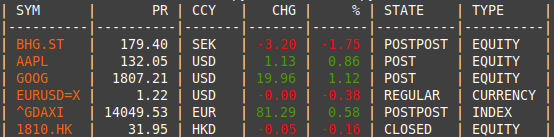
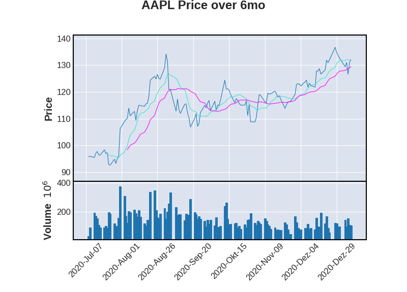

# stock market
Useful snippets of code for acquiring and analyzing stock market data.

## ticker.py

### Usage:

Put the stock market symbols as arguments for ticker.py in the command line.
```
$ python ticker.py BHG.ST AAPL GOOG EURUSD=X ^GDAXI 1810.HK
```

### Output:



### Data Source:

Data queries will be made to https://finance.yahoo.com/.


## history.py

### What it does:

Fetches historical stock market data through yfinance (https://pypi.org/project/yfinance/) and plots them utilizing mplfinance (https://pypi.org/project/mplfinance/) including moving average and traded volume. Also saves a csv with the data in the same folder as the script.

### Output


